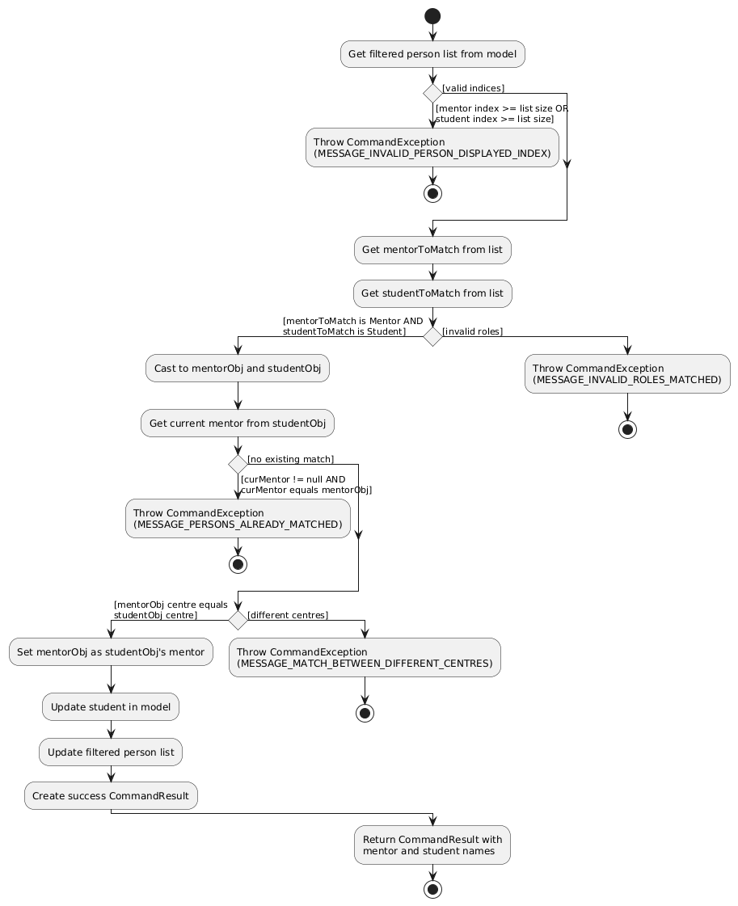

* Table of Contents
{:toc}

--------------------------------------------------------------------------------------------------------------------

## **Acknowledgements**

* This project is based on the AddressBook-Level3 project created by the [SE-EDU initiative](https://se-education.org).

--------------------------------------------------------------------------------------------------------------------

## **Setting up, getting started**

Refer to the guide [_Setting up and getting started_](SettingUp.md).

--------------------------------------------------------------------------------------------------------------------

## **Design**

:bulb: **Tip:** The `.puml` files used to create diagrams are in this document `docs/diagrams` folder. Refer to the [_PlantUML Tutorial_ at se-edu/guides](https://se-education.org/guides/tutorials/plantUml.html) to learn how to create and edit diagrams.

### Architecture

The ***Architecture Diagram*** given above explains the high-level design of the App.

Given below is a quick overview of main components and how they interact with each other.

**Main components of the architecture**

**`Main`** (consisting of classes [`Main`](https://github.com/AY2526S1-CS2103-F09-1/tp/blob/master/src/main/java/seedu/address/Main.java) and [`MainApp`](https://github.com/AY2526S1-CS2103-F09-1/tp/blob/master/src/main/java/seedu/address/Main.java)) is in charge of the app launch and shut down.
* At app launch, it initializes the other components in the correct sequence, and connects them up with each other.
* At shut down, it shuts down the other components and invokes cleanup methods where necessary.

The bulk of the app's work is done by the following four components:

* [**`UI`**](#ui-component): The UI of the App.
* [**`Logic`**](#logic-component): The command executor.
* [**`Model`**](#model-component): Holds the data of the App in memory.
* [**`Storage`**](#storage-component): Reads data from, and writes data to, the hard disk.

[**`Commons`**](#common-classes) represents a collection of classes used by multiple other components.

**How the architecture components interact with each other**

The *Sequence Diagram* below shows how the components interact with each other for the scenario where the user issues the command `delete 1`.

Each of the four main components (also shown in the diagram above),

* defines its *API* in an `interface` with the same name as the Component.
* implements its functionality using a concrete `{Component Name}Manager` class (which follows the corresponding API `interface` mentioned in the previous point.

For example, the `Logic` component defines its API in the `Logic.java` interface and implements its functionality using the `LogicManager.java` class which follows the `Logic` interface. Other components interact with a given component through its interface rather than the concrete class (reason: to prevent outside component's being coupled to the implementation of a component), as illustrated in the (partial) class diagram below.

The sections below give more details of each component.

### UI component

The **API** of this component is specified in [`Ui.java`](https://github.com/AY2526S1-CS2103-F09-1/tp/blob/master/src/main/java/seedu/address/ui/Ui.java)

The UI consists of a `MainWindow` that is made up of parts e.g.`CommandBox`, `ResultDisplay`, `PersonListPanel`, `StatusBarFooter` etc. All these, including the `MainWindow`, inherit from the abstract `UiPart` class which captures the commonalities between classes that represent parts of the visible GUI.

The `UI` component uses the JavaFx UI framework. The layout of these UI parts are defined in matching `.fxml` files that are in the `src/main/resources/view` folder. For example, the layout of the [`MainWindow`](https://github.com/se-edu/addressbook-level3/tree/master/src/main/java/seedu/address/ui/MainWindow.java) is specified in [`MainWindow.fxml`](https://github.com/se-edu/addressbook-level3/tree/master/src/main/resources/view/MainWindow.fxml)

The `UI` component,

* executes user commands using the `Logic` component.
* listens for changes to `Model` data so that the UI can be updated with the modified data.
* keeps a reference to the `Logic` component, because the `UI` relies on the `Logic` to execute commands.
* depends on some classes in the `Model` component, as it displays `Person` object residing in the `Model`.

### Logic component

**API** : [`Logic.java`](https://github.com/AY2526S1-CS2103-F09-1/tp/blob/master/src/main/java/seedu/address/logic/Logic.java)

Here's a (partial) class diagram of the `Logic` component:

The sequence diagram below illustrates the interactions within the `Logic` component, taking `execute("delete 1")` API call as an example.

:information_source: **Note:** The lifeline for `DeleteCommandParser` should end at the destroy marker (X) but due to a limitation of PlantUML, the lifeline continues till the end of diagram.

How the `Logic` component works:

1. When `Logic` is called upon to execute a command, it is passed to an `AddressBookParser` object which in turn creates a parser that matches the command (e.g., `DeleteCommandParser`) and uses it to parse the command.
1. This results in a `Command` object (more precisely, an object of one of its subclasses e.g., `DeleteCommand`) which is executed by the `LogicManager`.
1. The command can communicate with the `Model` when it is executed (e.g. to delete a person). 
   Note that although this is shown as a single step in the diagram above (for simplicity), in the code it can take several interactions (between the command object and the `Model`) to achieve.
1. The result of the command execution is encapsulated as a `CommandResult` object which is returned back from `Logic`.

Here are the other classes in `Logic` (omitted from the class diagram above) that are used for parsing a user command:

How the parsing works:
* When called upon to parse a user command, the `AddressBookParser` class creates an `XYZCommandParser` (`XYZ` is a placeholder for the specific command name e.g., `AddCommandParser`) which uses the other classes shown above to parse the user command and create a `XYZCommand` object (e.g., `AddCommand`) which the `AddressBookParser` returns back as a `Command` object.
* All `XYZCommandParser` classes (e.g., `AddCommandParser`, `DeleteCommandParser`, ...) inherit from the `Parser` interface so that they can be treated similarly where possible e.g, during testing.

### Model component
**API** : [`Model.java`](https://github.com/AY2526S1-CS2103-F09-1/tp/blob/master/src/main/java/seedu/address/model/Model.java)

The `Model` component,

* stores the address book data i.e., all `Person` objects (which are contained in a `UniquePersonList` object).
* stores the currently 'selected' `Person` objects (e.g., results of a search query) as a separate _filtered_ list which is exposed to outsiders as an unmodifiable `ObservableList<Person>` that can be 'observed' e.g. the UI can be bound to this list so that the UI automatically updates when the data in the list change.
* stores a `UserPref` object that represents the user’s preferences. This is exposed to the outside as a `ReadOnlyUserPref` objects.
* does not depend on any of the other three components (as the `Model` represents data entities of the domain, they should make sense on their own without depending on other components)

:information_source: **Note:** An alternative (arguably, a more OOP) model is given below. It has a `Tag` list in the `AddressBook`, which `Person` references. This allows `AddressBook` to only require one `Tag` object per unique tag, instead of each `Person` needing their own `Tag` objects. 

### Storage component

**API** : [`Storage.java`](https://github.com/AY2526S1-CS2103-F09-1/tp/blob/master/src/main/java/seedu/address/storage/Storage.java)

The `Storage` component,
* can save both address book data and user preference data in JSON format, and read them back into corresponding objects.
* inherits from both `AddressBookStorage` and `UserPrefStorage`, which means it can be treated as either one (if only the functionality of only one is needed).
* depends on some classes in the `Model` component (because the `Storage` component's job is to save/retrieve objects that belong to the `Model`)

### Common classes

Classes used by multiple components are in the `seedu.address.commons` package.

--------------------------------------------------------------------------------------------------------------------

## **Implementation**
### Match feature

#### Implementation

The match feature allows administrators to match mentors with students. It extends `Mentorface` with a functionality that connects a mentor and a student in a one-to-many relationship.

The match mechanism is facilitated by the `MatchCommand` class. It accepts two indices from the displayed person list and implements the following operation:

* `MatchCommand#execute()` — Matches a `Mentor` and a `Student` by setting the `mentor` attribute of the `Student` instance as the `Mentor` instance.

`MatchCommand` is used by the `MatchCommandParser` class, which helps to verify that the command is given in the correct format, i.e. with the correct arguments `m/` and `s/`.

Given below is an example usage scenario and how the matching mechanism behaves at each step.

Step 1. The user inputs the command `match m/2 s/1` to match the second person in the address book, a mentor, with the first person, a student. The `MatchCommandParser` class verifies that the command is given in the correct format, i.e. with the correct arguments `m/` and `s/`.

Step 2. `Index` objects are created for the mentor and student in `MatchCommandParser` with values `2` and `1` respectively. A `MatchCommand` object is created with the two `Index` objects as arguments.

Step 3. The `mentor` and `student` attributes of `MatchCommand` are initialised with the two `Index` objects passed into the constructor in the previous step.

Step 4. `MatchCommand` calls `Model#getFilteredPersonList()`, which obtains the list of persons last shown in the address book.

Step 5. The two indices `mentor` and `student` are checked to see if they are valid. If they are not, a `CommandException` is thrown.

Step 6. If the two indices are valid, we obtain two `Person` objects, `mentorToMatch` and `studentToMatch`, based on the indices specified. We then check if `mentorToMatch` and `studentToMatch` are instances of `Mentor` and `Student` respectively. If they are not, an exception is thrown.

Step 7. The current mentor of `studentToMatch` is obtained using `Student#getMentor()`. If it is equal to `mentorToMatch`, an exception is thrown specifying that the two are already matched.

Step 8. We then obtain the centres of both `studentToMatch` and `mentorToMatch`. If these are not the same, an exception is thrown specifying that the two must be the same. If the two are the same but this is because both have their centres unassigned, we also throw an exception.

Step 9. We match the mentor and student by using `student#setMentor()`. We then update the `model` using `model#setPerson()` and `model.updateFilteredPersonList()`.

#### Design considerations
Note that the reference between mentor and student is only stored in the `Student` object to prevent circular dependencies. In order to retrieve the students that a mentor is matched with, it is necessary to iterate through the entire list of people and check whether each person is a student of the mentor in question.

--------------------------------------------------------------------------------------------------------------------

## **Documentation, logging, testing, configuration, dev-ops**

* [Documentation guide](Documentation.md)
* [Testing guide](Testing.md)
* [Logging guide](Logging.md)
* [Configuration guide](Configuration.md)
* [DevOps guide](DevOps.md)

--------------------------------------------------------------------------------------------------------------------

## **Appendix: Requirements**

### Product scope

**Target user**: Peer tutoring NGOs such as Heartware Network

**Target user profile**:

* has a need to manage a significant number of contacts
* prefer desktop apps over other types
* can type fast
* prefers typing to mouse interactions
* is reasonably comfortable using CLI apps

**Value proposition**: Students from various institutions are deployed to tuition centres and schools across Singapore. Administrators struggle to track student and tutee information, making it hard to organise volunteers, monitor deployments, and identify understaffed schools. A proper system helps manage student details and ensure adequate support at beneficiary schools.

### User stories

Priorities: High (must have) - `* * *`, Medium (nice to have) - `* *`, Low (unlikely to have) - `*`

| Priority | As a …​                                   | I want to …​                                                                      | So that I can…​                                                                       |
|----------|-------------------------------------------|-----------------------------------------------------------------------------------|---------------------------------------------------------------------------------------|
| `* * *`  | Student volunteer                         | search up my own contact                                                          | know which tuition centre and student I have been assigned to                         |
| `* * *`  | Beneficiary                               | search for the students that are assigned to my location                          | be prepared and accommodate them to the best of my ability                            |
| `* * *`  | Administrator                             | sort the contacts by categories                                                   | know what role my contacts play                                                       |
| `* * *`  | Administrator                             | tag mentees to mentors                                                            | keep track of who the mentors are mentoring                                           |
| `* * *`  | Administrator                             | create different types of contacts                                                | keep track of the different types of people I am working with                         |
| `* * *`  | Administrator                             | match a student who has not been assigned a mentor to a mentor                    | better manage Mentor Student assignments                                              |
| `* * *`  | Experienced user                          | remove contacts easily                                                            | have a smaller list of contacts to utilize                                            |
| `* * *`  | Beneficiary                               | add student contacts                                                              | easily add to the list of students that require tutoring                              |
| `* *`    | Administrator                             | sort my contacts by the beneficiaries they are assigned to                        | have an easier time assigning mentors to the correct students                         |
| `* *`    | Administrator                             | sort by my contacts’ location                                                     | best assign the mentors to the students                                               |
| `* *`    | Administrator                             | sort by my contacts’ role                                                         | focus on managing contacts from a specific group                                      |
| `* *`    | Administrator                             | edit my personnel’s contacts                                                      | their entries if their contact details change                                         |
| `* *`    | Staff member of a partner school          | obtain a list of tutees and their corresponding matched tutors                    | inform my students who their tutor is                                                 |
| `* *`    | Administrator                             | unmatch students from mentors I have added by mistake                             | undo any matches added by mistake without deleting and adding the same contacts       |
| `* *`    | Administrator                             | list all the students who have not been assigned a mentor and vice versa          | better distribute the workload across all the mentors                                 |
| `* *`    | Manpower admin                            | sort the tutors and tutees by the centres they are deployed in                    | ensure each location receives enough students                                         |
| `* *`    | Parent of the student                     | identify which student is attached to my child                                    | communicate with them the needs of the child and track the progress of their learning |
| `* *`    | Administrator                             | keep track of which subjects my tutors are able to teach and tutees need help for | match them up appropriately                                                           |
| `* *`    | Student volunteer                         | track my students’ grades                                                         | Have an estimate of whether my work has helped them improve                           |
| `*`      | Director of outreach                      | identify patterns within the tutor sign-up rate                                   | better understand the demographic that is receptive to the publicity                  |
| `*`      | Administrator                             | track the status of my donors’ payments and payments to vendors                   | know who I need to continue completing financial transactions with                    |
| `*`      | Student volunteer                         | monitor the number of students and tutors at each centre                          | match these against my location preferences                                           |
| `*`      | First time user                           | transfer my contacts easily to the application                                    | not have to add all of them one by one                                                |
| `*`      | Teacher from a volunteer student’s school | keep track of the number of hours that they volunteered for                       | easily tally their VIA hours                                                          |
| `*`      | Fair administrator                        | flag if a mentor has too many mentees                                             | ensure that they are not overbooked                                                   |

### Use cases

(For all use cases below, the **System** is the `Mentorface` unless specified otherwise)

### Use case: U01 - Adding person to Mentorface

#### Actor: Administrator
#### MSS:
1. Administrator enters the information of the person they wish to add
2. Mentorface notifies the administrator that the person has been added

Use case ends

#### Extension:

#### 1a. Mentorface detects that the Administrator has given the information of the person in the incorrect format

1a1. Mentorface informs the user of the format error and shows the administrator an example of the correct format

1a2. Administrator enters the information of the person they wish to add again

Steps 1a1 and 1a2 repeats until Mentorface no longer detects an error with the input

1a3. Mentorface notifies the administrator that the person has been added

Use case ends

### Use case: U02 - Delete person from Mentorface

#### Actor: Administrator

#### MSS:
1. Administrator provides the input to delete a specified person from Mentorface
2. Mentorface deletes the person from the list and notifies the Administrator that the person has been deleted

Use case ends

#### Extension:

#### 1a. Mentorface detects that the administrator a person that does not exist in the list

1a1. Mentorface informs the administrator that the person they have specified does not exist, as well as the format the administrator should use when deleting people

1a2. Administrator enters the information of the person they wish to delete again

Steps 1a1 and 1a2 repeats until Mentorface can find the person specified by the administrator.

1a3. Mentorface deletes the person from the list and notifies the Administrator that the person has been deleted

Use case ends

### Use case: U03 - Find a person in Mentorface

#### Actor: Administrator

#### Person: Mentor, Student

#### MSS:
1. User provides the input to find a specified person from Mentorface
2. Mentorface finds the person from the list and shows the user the information associated with the person

Use case ends

#### Extension:
#### 1a. Mentorface detects that the administrator has provided the information for a person that does not exist in the list

1a1. Mentorface informs the administrator that the person they have specified does not exist, as well as the format the administrator should use when finding people

1a2. Administrator enters the information of the person they wish to find again

Steps 1a1 and 1a2 repeats until Mentorface can find the person specified by the administrator.

1a3. Mentorface finds the person from the list and shows the user the information associated with the person

Use case ends

### Use case: U04 - Match a person from Mentorface to another person from Mentorface

#### Actor: Administrator

#### MSS:
1. Administrator inputs the mentor and student that they want to match into Mentorface
2. Mentorface adds an attribute to indicate that the mentor and student have been matched and notifies the administrator that the match was successful

Use case ends

#### Extension:
#### 1a. Mentorface detects that the administrator has provided the information for people that do not exist in the list
1a1. Mentorface informs the administrator that the people they have specified do not exist, as well as the format the administrator should use when matching people

1a2. Administrator enters the information of the people they wish to match again

Steps 1a1 and 1a2 repeats until Mentorface can find the people specified by the administrator.

1a3. Mentorface adds an attribute to indicate that the mentor and student have been matched and notifies the administrator that the match was successful

Use case ends

### Use case: U05 - Editing the information of a person in Mentorface

#### Actor: Administrator

#### MSS:
1. Administrator provides the person they wish to change and the information they want changed
2. Mentorface makes the changes to the person and notifies the administrator that the information has been updated.

Use case ends

#### Extension:
#### 1a. Mentorface is unable to find the person that the administrator specified
1a1. Mentorface informs the user that the person they have specified does not exist

1a2. Administrator enters information and person they want edited again

Steps 1a1 and 1a2 repeats until Mentorface can find the person and there is no error with the format of the input

1a3. Mentorface notifies the administrator that the person’s information has been edited

Use case ends

#### 1b. Mentorface detects that the administrator has provided information in the incorrect format
1b1. Mentorface informs the user that the format they have provided for the person is incorrect and shows them an example of the correct format

1b2. Administrator enters information and person they want edited again

Steps 1b1 and 1b2 repeats until Mentorface can find the person and there is no error with the format of the input

1b3. Mentorface notifies the administrator that the person’s information has been edited

Use case ends

### Non-Functional Requirements

1. The system should be based on the current implementation of AB3 without deviating too much.
2. Only the administrators have the ability to make edits to the system
3. The system should only store Mentor and Student information
4. The system should launch in under 2 seconds
5. The system should add the contact to the address book in a reasonable amount of time, no more than 200ms
6. The system should filter and return the list is no more than 5 seconds
7. The system needs to work with older operating systems as NGOs may not have the latest versions. Minimally Windows 7 onwards, macOS 13 onwards, Linux Ubuntu 20 onwards
8. The system should have identical behaviour across Windows, macOS and Linux
9. The system needs to be able to store a large amount of contacts (at least 1000 inputs)
10. The system should account for the possibility that 2 inputs can be exactly the same
11. The system should be easy to understand for a novice user that prefers a CLI
12. The system should not support the upload of images for privacy reasons
13. The system should store the data locally on the user's device
14. The system only needs to handle input for 1 user at a given time
15. The system should work on a computer that has a version of java 17
16. The GUI of the system needs to work for screens with resolution of at least 1280x720 and higher
17. The system should be PDF friendly

### Glossary

* **Administrator**: The person in charge of the operations and logistics related to the functions of the NGO
* **Beneficiary**: An organisation (not necessarily a school) that is receiving help from the NGO in the form of tutoring services provided by the NGO
* **Tutor**: A student volunteer from a participating institution
* **Tutee**: A student from the beneficiary that is receiving the help from the tutor
* **Mentor**: Another word often used to refer to a Tutor
* **Student**: Another word often used to refer to a Tutee
* **Centre**: The location a student or mentor attends for sessions
* **Donor**: An organisation or individual that helps fund the NGO
* **Access Level**: The degree of permission a user has to update the system
* **NGO**: Abbreviation for non-government organisations

--------------------------------------------------------------------------------------------------------------------

## **Appendix: Instructions for manual testing**

Given below are instructions to test the app manually.

:information_source: **Note:** These instructions only provide a starting point for testers to work on;
testers are expected to do more *exploratory* testing.

### Launch and shutdown

1. Initial launch

   1. Download the jar file and copy into an empty folder

   1. Double-click the jar file Expected: Shows the GUI with a set of sample contacts. The window size may not be optimum.

1. Saving window preferences

   1. Resize the window to an optimum size. Move the window to a different location. Close the window.

   1. Re-launch the app by double-clicking the jar file. 
       Expected: The most recent window size and location is retained.

### Adding a person

1. Adding a person while all persons are being shown

   1. Test case: `add n/John Doe p/98765432 e/johnd@example.com a/311, Clementi Ave 2, #02-25 r/Student` 
      Expected: Student "John Doe" added with centre defaulting to "Centre Unassigned"

   1. Test case: `add n/Jane Doe p/91233213 e/jane@example.com a/420 Clementi Street 5 r/Mentor c/Clementi Primary School` 
      Expected: Mentor "Jane Doe" added with centre "Clementi Primary School"

   1. Test case: `add n/Sarah Lee p/91234567 e/sarah@example.com a/123 Main St r/MENTOR c/Bedok Centre t/Math t/Monday` 
      Expected: Person is not added as the role is invalid.

### Matching mentors and students

1. Matching a mentor and student

   1. Prerequisites: One mentor and one student both at "Bedok Centre"

   1. Note mentor index and student index

   1. Test case: `match m/MENTOR_INDEX s/STUDENT_INDEX` 
      Expected: Match successful, student's card displays mentor's name.

   1. Other incorrect match commands to try: matching two mentors, two students, mentor and student from different centres

### Editing a person

1. Editing the centre of a natched mentor/student
   
   1. Prerequisites: Mentor and student matched at same centre

   1. Note the matched mentor index

   1. Test case: `edit <mentor_index> c/Different Centre`  
      Expected: Mentor's centre updated and student's mentor field no longer shows the mentor's name.

### Deleting a person

1. Deleting a person while all persons are being shown

   1. Prerequisites: List all persons using the `list` command. Multiple persons in the list.

   1. Test case: `delete 1` 
      Expected: First contact is deleted from the list. Details of the deleted contact shown in the status message.

   1. Test case: `delete 0` 
      Expected: No person is deleted. Error details shown in the status message.

   1. Other incorrect delete commands to try: `delete`, `delete x`, `...` (where x is larger than the list size) 
      Expected: Similar to previous.

1. Deleting a matched mentor
   
   1. Prerequisites: Mentor and student(s) matched at same centre

   1. Note the matched mentor index

   1. Test case: `delete MENTOR_INDEX`  
      Expected:  Mentor is deleted. All of the mentor's former students no longer have the mentor's name displayed in their mentor field(s).

### Showing a mentor's students

1. Show students of a valid mentor

   1. Prerequisites: Mentor with matched students.

   1. Note the mentor's index

   1. Test case: `showstudent MENTOR_INDEX` 
      Expected: All students matched to the mentor displayed.
   
   1. Other incorrect `showstudent` commands to try: `showstudent MENTOR_INDEX` where the person at`MENTOR_INDEX` is a student, `showstudent` multiple times (need to use `list` between them to regenerate the list of all persons)

## **Appendix: Planned Enhancements**

### Adding two different people with the same name
* **It is currently not possible to add two different people with the same name.** Currently, users would have to append a numerical suffix to differentiate them (e.g. `n/Lim Jun Jie 1` and `n/Lim Jun Jie 2`) and obtain their information later on using`findbyname Lim Jun Jie`. We plan to allow the user to add people with the same name by removing the duplicate name check and prompting them with a button should this situation occur, which they can click to agree to add the new person at their own risk.

* **It is currently not possible to include special characters in people's names**. Currently, users have to omit the part of the name containing the special character at their own discretion (e.g. Lim Jun Jie, Bala Krishnan) when adding them. We plan to allow some such characters to be part of a person's name, and enforce this using regex.
