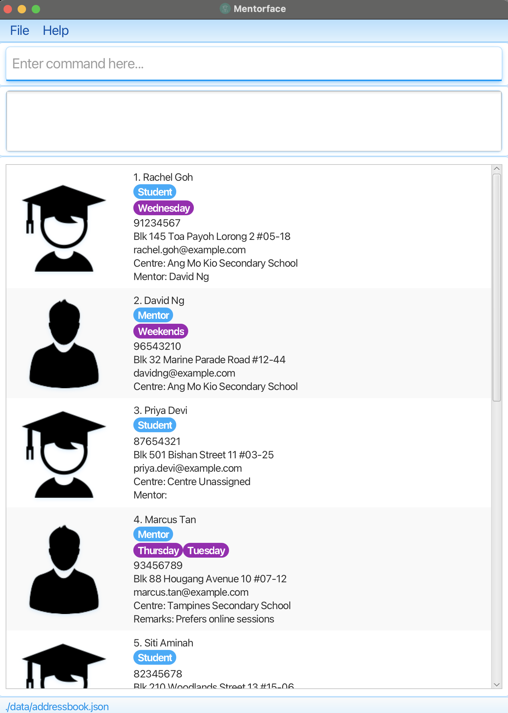
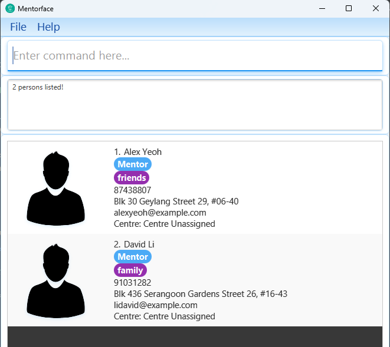

Mentorface is a **desktop app for managing personal details of mentors and students in a volunteer tuition programme, optimized for use via a Command Line Interface** (CLI) while still having the benefits of a Graphical User Interface (GUI). If you can type fast, Mentorface can get your contact management tasks done faster than traditional GUI apps.

* Table of Contents
{:toc}

--------------------------------------------------------------------------------------------------------------------

## Quick start

1. Ensure you have Java `17` or above installed in your Computer. 
   **Mac users:** Ensure you have the precise JDK version prescribed [here](https://se-education.org/guides/tutorials/javaInstallationMac.html).

1. Download the latest `.jar` file from [here](https://github.com/AY2526S1-CS2103-F09-1/tp/releases/tag/v1.5).

1. Copy the file to the folder you want to use as the _home folder_ for your app.

1. Open a command terminal, `cd` into the folder you put the jar file in, and use the `java -jar addressbook.jar` command to run the application. 
   A GUI similar to the below should appear in a few seconds. Note how the app contains some sample data. 
   

1. Type the command in the command box and press Enter to execute it. e.g. typing **`help`** and pressing Enter will open the help window. 
   Some example commands you can try:

   * `list` : Lists all contacts.

   * `add n/John Doe p/98765432 e/johnd@example.com a/311, Clementi Ave 2, #02-25 r/Student c/Bedok Centre t/friends t/owesMoney` : Adds a student named `John Doe` to the Address Book.

   * `delete 3` : Deletes the 3rd contact shown in the current list.

   * `clear` : Deletes all contacts.

   * `exit` : Exits the app.

1. Refer to the [Features](#features) below for details of each command.

--------------------------------------------------------------------------------------------------------------------

## Features

**:information_source: Notes about the command format:** 

* Words in `UPPER_CASE` are the parameters to be supplied by the user. 
  e.g. in `add n/NAME`, `NAME` is a parameter which can be used as `add n/John Doe`.

* Items in square brackets are optional. 
  e.g `n/NAME [t/TAG]` can be used as `n/John Doe t/friend` or as `n/John Doe`.

* Items with `…`​ after them can be used multiple times including zero times. 
  e.g. `[t/TAG]…​` can be used as ` ` (i.e. 0 times), `t/friend`, `t/friend t/family` etc.

* Parameters can be in any order. 
  e.g. if the command specifies `n/NAME p/PHONE_NUMBER`, `p/PHONE_NUMBER n/NAME` is also acceptable.

* Extraneous parameters for commands that do not take in parameters (such as `help`, `list`, `exit` and `clear`) will be ignored. 
  e.g. if the command specifies `help 123`, it will be interpreted as `help`.

* If you are using a PDF version of this document, be careful when copying and pasting commands that span multiple lines as space characters surrounding line-breaks may be omitted when copied over to the application.

### Viewing help : `help`

Shows a message explaining how to access the help page.

Format: `help`

### Adding a person: `add`

Adds a person to the address book. 

A person **must have a role** that is either student or mentor. This is specified using the parameter `r/` as either `r/Student` or `r/Mentor`.

A person can also have a centre assigned when added. This is specified using the parameter `c/`. If no centre is specified, the centre will take on the default value `Centre Unassigned`.

Format: `add n/NAME p/PHONE_NUMBER e/EMAIL a/ADDRESS r/ROLE [c/CENTRE] [t/TAG]…​`

:bulb: **Tip:**
A person can have any number of tags (including 0)

Examples:
* `add n/John Doe p/98765432 e/johnd@example.com a/John street, block 123, #01-01 r/Mentor`
* `add n/Betsy Crowe t/Friday e/betsycrowe@example.com c/New Town Secondary School a/Blk 69 Newgate Road #4-20 p/94248390 r/Student`

### Listing all persons : `list`

Shows a list of all persons in the address book.

Format: `list`

### Clearing all entries : `clear`

Clears all entries from the address book.

Format: `clear`

### Deleting a person : `delete`

Deletes the specified person from the address book.

Format: `delete INDEX`

* Deletes the person at the specified `INDEX`.
* The index refers to the index number shown in the displayed person list.
* The index **must be a positive integer** 1, 2, 3, …​
* **IMPORTANT NOTE**: If the person deleted is a mentor of a particular student, the mentor-student relationship between the two will be removed too.

Examples:
* `list` followed by `delete 2` deletes the 2nd person in the address book.
* `findbyname Betsy` followed by `delete 1` deletes the 1st person in the results of the `find` command.

### Editing a person : `edit`

Edits an existing person in the address book.

Format: `edit INDEX [n/NAME] [p/PHONE] [e/EMAIL] [a/ADDRESS] [c/CENTRE] [t/TAG]…​`

* Edits the person at the specified `INDEX`. The index refers to the index number shown in the displayed person list. The index **must be a positive integer** 1, 2, 3, …​
* At least one of the optional fields must be provided.
* **Note that it is not possible to edit a person's role**.
* Existing values will be updated to the input values.
* When editing tags, the existing tags of the person will be removed i.e adding of tags is not cumulative.
* You can remove all the person’s tags by typing `t/` without
    specifying any tags after it.
* **IMPORTANT NOTE**: If a mentor and a student are matched to each other and you edit the centre of either of them, they will automatically be unmatched.

Examples:
*  `edit 1 p/91234567 e/johndoe@example.com` Edits the phone number and email address of the 1st person to be `91234567` and `johndoe@example.com` respectively.
*  `edit 2 n/Betsy Crower t/` Edits the name of the 2nd person to be `Betsy Crower` and clears all existing tags.

### Matching a mentor and a student: `match`

* Matches a mentor and student with each other.

Format: `match m/MENTOR_INDEX s/STUDENT_INDEX`

* Matches the mentor at `MENTOR_INDEX` with the student at `STUDENT_INDEX`. The index refers to the index number shown in the displayed person list. The index must be a positive integer 1, 2, 3, …​
* A match can only be performed if the person at `MENTOR_INDEX` has the mentor role, and if the person at `STUDENT_INDEX` has the student role.
* A match can only be performed between a mentor and student who are assigned to the same centre.
* After matching, the student's mentor is displayed as a field in the app.

Examples:
* `match m/1 s/2` matches the mentor at the first index and the student at the second index.
  

### Unmatching a mentor and a student: `unmatch`

* Unmatches a mentor and student from each other.

Format: `unmatch m/MENTOR_INDEX s/STUDENT_INDEX`

* Unmatches the mentor at `MENTOR_INDEX` from the student at `STUDENT_INDEX`. The index refers to the index number shown in the displayed person list. The index must be a positive integer 1, 2, 3, …​
* Unmatch can only be performed if the mentor and student were already matched previously.
* After matching, the student's mentor is no longer displayed.

Examples:
* `unmatch m/1 s/2` unmatches the mentor at the first index and the student at the second index.

### Locating persons by name: `findbyname`

Finds persons whose names contain any of the given keywords.

Format: `findbyname KEYWORD [MORE_KEYWORDS]`

* The search is case-insensitive. e.g `hans` will match `Hans`
* The order of the keywords does not matter. e.g. `Hans Bo` will match `Bo Hans`
* Only the name is searched.
* Only full words will be matched e.g. `Han` will not match `Hans`
* Persons matching at least one keyword will be returned (i.e. `OR` search).
  e.g. `Hans Bo` will return `Hans Gruber`, `Bo Yang`

Examples:
* `findbyname John` returns `john` and `John Doe`
* `findbyname alex david` returns `Alex Yeoh`, `David Li` 
  

### Locating persons by address: `findbyaddress`

  Find persons whose address matches any of the keywords.

  Format: `findbyaddress KEYWORD`

  * The keyword is a substring of the result so it does not have to be the whole address for easier searching. eg `Cle` is a substring of    `Clementi Ave 2`

  Examples:
  
  * `findbyaddress Clementi Ave 2`

### Locating persons by centre: `findbycentre`

Finds persons whose centre matches any of the keywords.

  Format: `findbycentre KEYWORD`

  * Similar to findbyaddress, keyword is  a substring of the result
  * Contacts that do not have a centre assigned yet will have their field as `Centre Unassigned`. Thus, any substring of that, will list the said person

  Examples:
  
  * `findbycentre Nan Hua High School`

### Locating persons by role: `findbyrole`

Finds persons by role.

  Format: `findbyrole ROLE`

  * Currently, the system has only Mentor and Student specific roles, therefore the only roles that can be used is Mentor and Student
  * Case-sensitive. `MENTOR` is not the same as `Mentor` and thus would not work

  Examples:
  
  * `findbyrole Mentor`
  * `findbyrole Student`

### Listing unmatched students and mentors in a centre: `listunmatched`

### Listing students of a mentor: `showstudent`

List all the students matched to the mentor of your choosing.

Format: `showstudent INDEX`

* Shows all the students of the mentor of the specified `INDEX`
* Index must be a valid positive integer in the list
* Index must be a Mentor. An error message will be shown if the role is not a mentor
* After executing the command, enter the command `list` to use `showstudent` again on another Mentor

Examples:
* `showstudent 3`

### Making a remark on a contact: `remark`

Make a remark about the person.

Format `remark INDEX rm/REMARK`

* Index must be a valid positive integer in the list
* Remarks are not edited through the `edit` command, if you want to edit a remark, reuse the `remark` command
* Remarks are optional. If a person does not have any remark, it would not show in the address book

Examples:
* `remark 3 rm/only free on Friday`

### Exiting the program : `exit`

Exits the program.

Format: `exit`

### Saving the data

AddressBook data are saved in the hard disk automatically after any command that changes the data. There is no need to save manually.

### Editing the data file

AddressBook data are saved automatically as a JSON file `[JAR file location]/data/addressbook.json`. Advanced users are welcome to update data directly by editing that data file.

:exclamation: **Caution:**
If your changes to the data file makes its format invalid, AddressBook will discard all data and start with an empty data file at the next run. Hence, it is recommended to take a backup of the file before editing it. 
Furthermore, certain edits can cause the AddressBook to behave in unexpected ways (e.g., if a value entered is outside of the acceptable range). Therefore, edit the data file only if you are confident that you can update it correctly.

### Archiving data files `[coming in v2.0]`

_Details coming soon ..._

--------------------------------------------------------------------------------------------------------------------

## FAQ

**Q**: How do I transfer my data to another Computer? 
**A**: Install the app in the other computer and overwrite the empty data file it creates with the file that contains the data of your previous AddressBook home folder.

--------------------------------------------------------------------------------------------------------------------

## Known issues

1. **When using multiple screens**, if you move the application to a secondary screen, and later switch to using only the primary screen, the GUI will open off-screen. The remedy is to delete the `preferences.json` file created by the application before running the application again.
2. **If you minimize the Help Window** and then run the `help` command (or use the `Help` menu, or the keyboard shortcut `F1`) again, the original Help Window will remain minimized, and no new Help Window will appear. The remedy is to manually restore the minimized Help Window.
3. **It is currently not possible to add two different people with the same name.** If you happen to have two people with the same name, we recommend you include a numerical suffix to differentiate them (e.g. `n/Lim Jun Jie 1` and `n/Lim Jun Jie 2`). If you need to obtain their information later on, you can use `findbyname Lim Jun Jie` to list all the different people with the same name and differentiate them using the rest of their details.
4. **It is currently not possible to include special characters in people's names**. Names can only contain alphanumeric characters and spaces. If someone's name contains other characters (e.g. Lim Jun-Jie, Bala s/o Krishnan), we suggest that you omit the part of their name containing the special character at your own discretion (e.g. Lim Jun Jie, Bala Krishnan) when adding them.

--------------------------------------------------------------------------------------------------------------------

## Command summary

Action | Format, Examples
--------|------------------
**Help** | `help`
**Add** | `add n/NAME p/PHONE_NUMBER e/EMAIL a/ADDRESS r/ROLE [c/CENTRE] [t/TAG]…​`   e.g., `add n/James Ho p/22224444 e/jamesho@example.com a/123, Clementi Rd, 1234665 r/Student c/Punggol Primary School t/Monday`
**List** | `list`
**Clear** | `clear`
**Delete** | `delete INDEX`  e.g., `delete 3`
**Edit** | `edit INDEX [n/NAME] [p/PHONE_NUMBER] [e/EMAIL] [a/ADDRESS] [r/ROLE] [c/CENTRE] [t/TAG]…​`  e.g.,`edit 2 n/James Lee e/jameslee@example.com`
**Match** | `match m/INDEX s/INDEX`   e.g., `match m/2 s/3`
**Unmatch** | `unmatch m/INDEX s/INDEX`   e.g., `unmatch m/2 s/3`
**Find By Name** | `findbyname KEYWORD [MORE_KEYWORDS]`  e.g., `find James Jake`
**Find By Address** | `findbyaddress PART_OF_ADDRESS`  e.g., `findbyaddress Clementi`
**Find By Centre** | `findbycentre PART_OF_CENTRE`   e.g., `findbycentre Nan Hua High School`
**Find By Role** | `findbyrole ROLE`   e.g., `findbyrole Student`
**List Unmatched** | `listunmatched KEYWORD`   e.g., `listunmatched Punggol Primary School`
**Show Students** | `showstudent INDEX`   e.g., `showstudent 3`
**Remark** | `remark INDEX rm/REMARK`   e.g., `remark 3 rm/only free on Friday`
**Exit** | `exit`